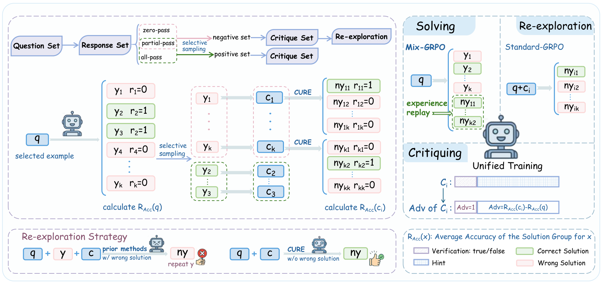

# CURE

CURE: Critique-Driven Unified Reinforcement Learning for Test-Time Self-Improvement

## Method Overview



CURE is a unified RLVR framework for training a single policy to solve, self-verify, critique, and re-explore. Instead of relying on external teacher feedback at test time, CURE teaches the model to generate high-level strategic hints and use them to restart reasoning from a fresh context. This critique-driven loop helps reduce anchoring on initial incorrect solutions and enables iterative test-time self-improvement for reasoning tasks.

## Install

CURE is based on `verl` 0.5.0. You can install the runtime by following the
[official verl 0.5.x documentation](https://verl.readthedocs.io/en/v0.5.x/), or
use the dependency snapshot in this repository.

```bash
conda create -n cure python=3.11 -y
conda activate cure
pip install -r requirements.txt
pip install -e . --no-deps
```

Install cluster-specific CUDA/PyTorch packages according to your hardware and
the verl documentation.

## Data Prep

CURE uses training data from a subset of
[`zwhe99/DeepMath-103K`](https://huggingface.co/datasets/zwhe99/DeepMath-103K).
Following the paper, remove examples whose answers are binary and randomly
downsample the remaining pool to 76,800 examples.

Next, prepare the dataset for training with verl:

```bash
python -m recipe.cure.scripts.prepare_data \
  --input-path data/DeepMath-103K/train.parquet \
  --output-path data/DeepMath-103K/train_76k8.parquet
```

Use `--input-path` and `--output-path` to point the script to your local
preprocessed DeepMath-103K parquet files.

## Run Main Experiment

```bash
bash recipe/cure/run_qwen2.5-7b_math.sh
```

The script runs on 4 GPUs by
default. The most commonly changed environment variables are:

| Variable | Default | Description |
| --- | --- | --- |
| `MODEL_PATH` | `Qwen/Qwen2.5-7B-Instruct` | HF model id or local checkpoint path |
| `DATA_HOME` | `$PWD/data` | Directory containing `DeepMath-103K/train_76k8.parquet` and validation files |
| `CHECKPOINT_DIR` | `$PWD/checkpoints` | Base checkpoint output directory |
| `WANDB_API_KEY` | unset | Set in your shell before running if using W&B |

You can also override verl/Hydra arguments at the end of the command.

## Citation

```bibtex
@misc{anonymous2026cure,
  title        = {CURE: Critique-Driven Unified Reinforcement Learning for Test-Time Self-Improvement},
  author       = {Anonymous Authors},
  year         = {2026},
  note         = {Under double-anonymous review}
}
```

## Acknowledgements

This project is built upon [verl](https://github.com/volcengine/verl). We sincerely thank the verl team and community for their great work! 😀

## License

Apache-2.0. See `LICENSE`; upstream verl attribution is included in `NOTICE`.
